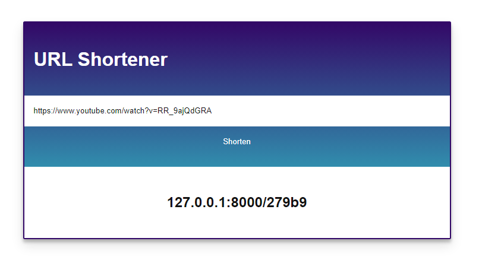

# URL shortener using Django



## Starting the back-end Django application

In a new terminal tab:

1. Install the back-end requirements in the environment of your choice:
  ```shell
  $ cd /path/to/repo/
  $ python3 -m pip install -r requirements.txt
  ```
2. Create a file called .env in the root of the project and add a secure secret key
```
SECRET_KEY = 'lqhtkx3n6y3%l63fq%90pxk@7#l+jyhz$6a^v%3g)#2o265tk!'
```
3. Create the initial Django database by running migrations:
  ```shell
  $ python manage.py migrate
  ```
4. Create a Django superuser:
  ```shell
  $ python manage.py createsuperuser
  ```
5. Run the Django project (by default on port 8000):
  ```shell
  $ python manage.py runserver
  ```

## URL management

1. Visit [the Django admin](https://localhost:8000/admin)
2. Log in using the superuser you created earlier
3. You can remove/manually add URLs

## Shorten URLs

1. Visit [the homepage](https://localhost:8080)
2. Paste a URL into the box
3. Hit submit
4. Copy + paste generate short URL into browser
5. Profit???
